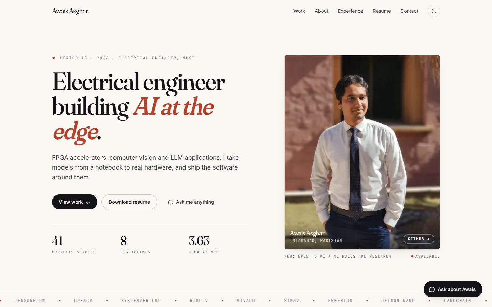

# Awais Asghar — portfolio

**Live:** https://awais-portfolio-phi-six.vercel.app

Personal site for Awais Asghar, an electrical engineer (NUST, 2026) working where machine learning meets constrained hardware: FPGA accelerators, computer vision, LLM applications and embedded systems. Every public project is categorised, illustrated with a generated thumbnail, and documented in one place, with an assistant that answers questions about the work and can pass a message straight to his inbox.



## What's on the site

- **41 projects across 8 disciplines** (AI/ML, computer vision, LLMs & agents, FPGA & digital design, embedded & IoT, robotics, web, HPC). The grid filters by category and searches across tools and tags. Each project page renders its GitHub README in place, refreshed daily.
- **Generated thumbnails.** Every project has its own deterministic SVG illustration drawn by a small motif renderer (a star field with a drifting object for the TNO detector, woven fabric with a flagged defect, a five-stage pipeline, an ECG trace, a state machine, and so on). `npm run thumbs` regenerates all of them.
- **Ask about Awais.** A chat assistant on Groq (`openai/gpt-oss-120b`, with automatic fallback to smaller models) that answers only from the site's own content, links to the relevant project pages, and can email Awais a visitor's message after collecting their name and address.
- **Contact form** delivered through Resend, with a honeypot, validation and rate limiting.
- **Two resumes** (AI Engineer and Hardware/EE, both in Jake's LaTeX template) with an inline preview switcher.
- Light and dark themes, reduced-motion support, Open Graph image, sitemap, JSON-LD, and a `/api/health` endpoint that reports which integrations are configured.

## Stack

Next.js 16 (App Router, Turbopack) · React 19 · TypeScript · Tailwind CSS v4 · motion · groq-sdk · Resend · react-markdown · Vercel

## Develop

```bash
npm install
cp .env.example .env.local   # add GROQ_API_KEY and RESEND_API_KEY
npm run dev                  # http://localhost:3000
```

| Script | What it does |
|---|---|
| `npm run build` | production build (type-checks too) |
| `npm run check` | `tsc --noEmit` + ESLint |
| `npm run thumbs` | regenerate `public/thumbnails/*.svg` from `src/data/projects.ts` |
| `npm run prompt-size` | print the chatbot system prompt size (keep it under ~5k tokens for Groq's free tier) |

Content lives in `src/data/`: `profile.ts` (bio, experience, honors, skills), `projects.ts` (every project), `categories.ts`. Adding a project is one entry in `projects.ts` plus `npm run thumbs`; the grid, detail page, sitemap and chatbot all pick it up.

The Hardware resume source is in `resume/hardware/` and builds with `tectonic Awais_Asghar_Hardware.tex` (or Overleaf).

## Deployment

Pushes to `main` deploy automatically on Vercel. Environment variables (`GROQ_API_KEY`, `RESEND_API_KEY`, optional `GITHUB_TOKEN`, `GROQ_MODEL`, `NEXT_PUBLIC_SITE_URL`) are set in the Vercel dashboard; `GET /api/health` confirms which ones the running deployment sees.

## Project docs

Design system, content model, chatbot architecture, decisions and backlog are documented in [`claude.md`](./claude.md).
