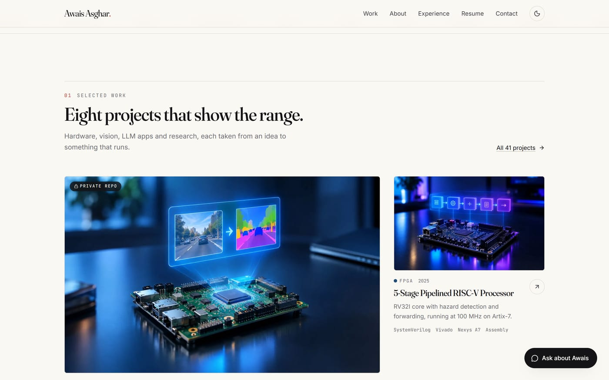

<div align="center">

# Awais Asghar — portfolio

**[awais-asghar.vercel.app](https://awais-asghar.vercel.app)**

Electrical engineer working where machine learning meets constrained hardware:
FPGA accelerators, computer vision, LLM applications and embedded systems.


</div>

## What's on the site

**41 projects, 8 disciplines, one place.** Everything I have built, from a RISC-V core in SystemVerilog to a receipt-reading ledger app, filterable by discipline and searchable across tools and tags. Each project page pulls its README straight from GitHub and renders it in place, refreshed daily.


**A cover image for every project.** Most projects carry a rendered scene of the hardware or system they are about, set through an optional `thumbnail` field. Any project without one falls back to an illustration drawn in code: a generator reads the project list and draws a motif from a seed taken from the slug, so the output is identical on every run. The AQI monitor gets a particle field and a gauge, the PID rig gets its beam and a settling curve, the AM receiver gets its carrier and envelope.



**An assistant that knows the work.** Ask it about a project, a board, a paper or availability and it answers from the site's own content, links the relevant project page, and declines anything off topic. It can also take your name, address and message and deliver them to my inbox without you leaving the page.

<div align="center"></div>

**And the rest.** A contact form with validation, a honeypot and rate limiting. Two resumes with an inline preview switcher. Light and dark themes, reduced-motion support, a generated Open Graph card, sitemap and JSON-LD.


## How it's built

| | |
|---|---|
| Framework | Next.js 16, App Router, Turbopack |
| UI | React 19, TypeScript, Tailwind CSS v4, motion |
| Chat | Groq `openai/gpt-oss-120b`, falling back to smaller models on rate limits |
| Email | Resend |
| Content | typed files in `src/data`, no CMS and no database |
| Hosting | Vercel, deployed on every push to `main` |

Content lives in three files. `profile.ts` holds the bio, experience, honors and skills, `projects.ts` holds every project, and `categories.ts` defines the eight disciplines. Adding a project is one entry plus a thumbnail run, and the grid, the detail page, the sitemap and the assistant all pick it up, because the assistant's knowledge is built from the same file the pages render from.

## Running it

```bash
npm install
cp .env.example .env.local   # GROQ_API_KEY and RESEND_API_KEY
npm run dev                  # http://localhost:3000
```

The site builds and runs without either key. The chat and the form detect that and fall back to an email link rather than failing.

| Script | Purpose |
|---|---|
| `npm run build` | production build, type-checks as it goes |
| `npm run check` | `tsc --noEmit` and ESLint |
| `npm run thumbs` | regenerate every thumbnail from `src/data/projects.ts` |
| `npm run prompt-size` | print the assistant's prompt size, which has to fit Groq's per-minute budget |

`GET /api/health` reports the deployed commit and which integrations the running deployment can see.

The Hardware resume is written in Jake's LaTeX template under `resume/hardware/` and builds with `tectonic Awais_Asghar_Hardware.tex`.

## Docs

The design system, content model, assistant architecture, deployment notes and a dated decision log are in [`claude.md`](./claude.md).
